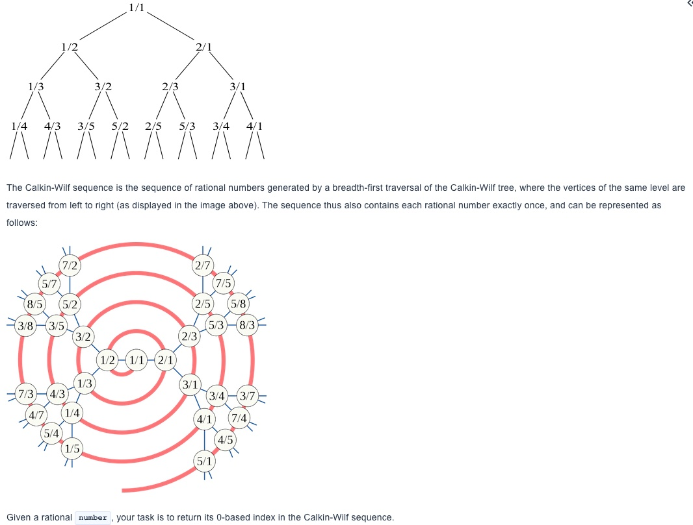

> ### Yin and Yang of Yields

---

# Calkin Wilf Sequence

#### Source: [codesignal.com](https://codesignal.com/) Python Arcade

---

The Calkin-Wilf tree is a tree in which the vertices correspond 1-for-1 to the positive rational numbers. The tree is rooted at the number 1, and any rational number expressed in simplest terms as the fraction `a / b` has as its two children the numbers `a / (a + b)` and `(a + b) / b`. Every positive rational number appears exactly once in the tree. Here's what it looks like:

##### Example

For `number = [1, 3]`, the output should be
`solution(number) = 3`.

As you can see in the image above,` 1 / 3` is the `3rd` 0-based number in the sequence.
